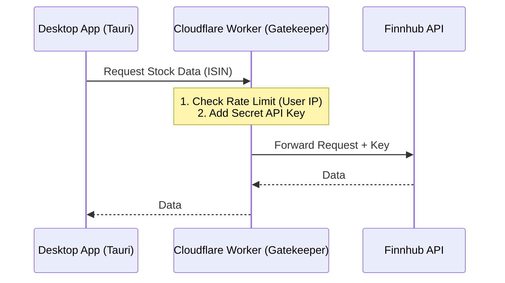

# Architecture Strategy: Security & Community Data

## 1. The API Key Problem
**Challenge:** You cannot distribute the Finnhub API Key in the desktop app (Client). It will be extracted and abused, leading to your account being banned.

### Recommended Solution: The "Gatekeeper" Proxy
You must stick with a proxy server, but it can be extremely lightweight.

**Architecture:**

**Implementation Details:**
-   **Technology:** **Cloudflare Workers** (Free tier is generous, 100k reqs/day).
-   **Logic:**
    -   The Worker holds the `FINNHUB_API_KEY` in its secure environment variables.
    -   It accepts requests from your App (e.g., `GET /price?symbol=AAPL`).
    -   It acts as a firewall: blocking abuse, caching frequent requests (saving you money/quota), and injecting the key before calling Finnhub.
-   **Why:** Zero maintenance, free for starters, scales infinitely, hides your key perfectly.

---

## 2. The Community Data Problem ("The Hive Mind")
**Challenge:** You want `asset_universe.csv` (the map of ISIN -> Ticker) to grow as users discover new assets, benefiting everyone.

### Recommended Solution: "Telemetry & Sync" Pattern
We treat the `asset_universe` as a distributed database where clients "contribute" discoveries and "subscribe" to the master list.

**Architecture:**

```mermaid
flowchart TD
    subgraph Client["User's Laptop"]
        LocalDB[("Local Asset Universe")]
        Resolver["ISIN Resolver"]
    end

    subgraph Cloud["Your Cloud Backend"]
        Ingest["📥 Contribution API"]
        MasterDB[("Master Universe DB")]
        PublicList["📄 Public CSV (CDN)"]
    end

    Resolver -->|"1. Resolve New ISIN"| LocalDB
    Resolver -.->|"2. Async Background Post"| Ingest
    Ingest --> MasterDB
    MasterDB -.->|"3. Periodic Export"| PublicList
    PublicList -->|"4. Auto-Update on Launch"| LocalDB
```

### Workflow:

1.  **The "Smart" Client (Contribution):**
    -   User A loads a portfolio with a rare ETF.
    -   The Python engine identifies it's missing from `asset_universe.csv`.
    -   It resolves it using the expensive method (Finnhub/OpenFIGI/Scraping).
    -   **Action:** Once successfully resolved, the app silently sends a POST request to your backend:
        `POST /contribute { "isin": "DE000...", "ticker": "ABC.DE", "name": "..." }`

2.  **The "Master" Backend (Validation):**
    -   Your backend receives the contribution.
    -   **Validation:** It checks if the data looks sane (simple heuristics).
    -   It adds it to the Master Database (Supabase or simple SQLite).

3.  **The Feedback Loop (Distribution):**
    -   Every 6 hours (or on change), the backend generates a new `asset_universe_v2.csv` and uploads it to a public URL (GitHub Pages or R2/S3).
    -   **Client Update:** When User B opens their app, it checks: "Is my `asset_universe` version older than the Cloud version?"
    -   If yes, it downloads the new CSV.
    -   **Result:** User B now instantly recognizes the ETF that User A discovered yesterday.

### Technology Choice:
-   **Database:** **Supabase** (Postgres). Free tier is excellent. Realtime not strictly needed, REST API is auto-generated.
-   **Contribution Endpoint:** A simple Edge Function (Supabase Functions or Cloudflare Worker) to validate the input before saving.

## Summary of Infrastructure
To support the Desktop App, you need two small cloud pieces:
1.  **Proxy (Cloudflare Worker):** Protects your Finnhub Key.
2.  **Community DB (Supabase):** Aggregates and redistributes the shared knowledge.

Both have generous free tiers that will last you until you have thousands of users.
