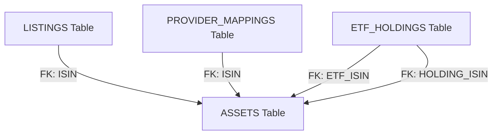

# Hive Architecture Strategy

> **Purpose:** Strategic decisions on the "Hive" community database, schema normalization, and crowdsourced data governance.
> **Scope:** Defines the "Source of Truth" for shared financial data (ISINs, Metadata, ETF Holdings).
> **Also read:** `anamnesis/strategy/data-architecture.md` for local storage context.
> **Also read:** `anamnesis/strategy/external-integrations.md` for trust scoring logic.

---

## Executive Summary

The **Supabase Hive** is the "Community Brain" of Portfolio Prism. It solves the fragmentation of financial data by crowdsourcing a single, normalized "Source of Truth." Instead of relying on expensive centralized feeds or fragile scrapers, the Hive aggregates knowledge from all users to map messy broker data (Tickers/Aliases) to clean atomic identities (ISINs) and reveal the underlying composition of ETFs ("X-Ray").

**Key Decision:** We use a **Normalized Relational Schema** (PostgreSQL) rather than JSON blobs. This enables powerful "Reverse Lookups" (e.g., "Which ETFs hold Defense stocks?") and precise currency handling, despite the operational cost of higher row counts.

---

## 1. The Core Problem: "One Asset, Many Faces"

Financial data is inherently messy. A single legal entity (Asset) appears in many forms across different markets.

*   **Currency Chaos:** Nvidia trades in **USD** (Nasdaq) and **EUR** (Xetra).
*   **Ticker Collisions:** Apple is `AAPL` (US), `APC` (Germany), `0R2V` (London). `ABC` might be a tech stock in the US and a mining company in Canada.
*   **Opaque Wrappers:** An ETF is just a wrapper around thousands of other Assets. Without "X-Ray" data, users cannot see their true exposure.

### Strategic Requirement
The database must distinguish between:
1.  **The Entity:** What is it? (Apple Inc, US0378331005)
2.  **The Listing:** How do I buy it? (Ticker `APC`, Currency `EUR`, Exchange `XETRA`)
3.  **The Composition:** What is inside it? (ETF Holdings)

---

## 2. Strategic Architecture: Normalized Schema

We reject the "NoSQL/JSON Blob" approach for the core data. While JSON is flexible, it makes "Cross-Asset" queries impossible (e.g., finding overlap between two ETFs).

### 2.1 The "Diamond" Schema

### 2.2 Table Definitions

#### **1. `assets` (The Entity)**
The immutable anchor.
*   **Purpose:** Store properties inherent to the company/fund, not the market.
*   **Key Fields:** `isin` (PK), `name`, `wkn`, `asset_class`, `base_currency` (Accounting currency).
*   **Status:** Includes `enrichment_status` ('active', 'stub') to handle auto-created assets.

#### **2. `listings` (The Quote)**
The resolution layer. Solves the currency/exchange ambiguity.
*   **Purpose:** Map user input (Ticker) to the Entity (ISIN).
*   **Key Fields:** `ticker` + `exchange` (PK), `currency` (Trading currency), `isin` (FK).

#### **3. `provider_mappings` (The Aliases)**
The normalization engine.
*   **Purpose:** Map API-specific IDs to the Entity.
*   **Key Fields:** `provider` (e.g. 'Yahoo'), `provider_id` (e.g. 'APC.DE'), `isin` (FK).

#### **4. `etf_holdings` (The X-Ray)**
The recursive composition.
*   **Purpose:** Link Funds to Assets.
*   **Strategy:** **Current State Only**. This table is wiped and rewritten on update to keep it lean for "Live Analytics."
*   **Key Fields:** `etf_isin`, `holding_isin`, `weight` (0.0-1.0), `last_updated`.

---

## 3. Data Governance Strategy

Crowdsourced data is prone to staleness and poisoning. We employ a "Trust but Verify" model.

### 3.1 Handling Staleness (The "Decay" Trigger)
*   **Logic:** Data > 30 days old is flagged as "Stale."
*   **Action:** The Client App checks `last_updated`. If stale, it prompts the user (or runs a background scraper) to fetch fresh data from the provider and upload it to the Hive.
*   **Result:** Active users naturally keep the database fresh.

### 3.2 Handling "Stub" Assets
When an ETF upload references a stock not yet in our universe:
1.  **Accept:** The Hive accepts the upload to avoid blocking the user.
2.  **Stub:** It auto-creates a "Stub Asset" (`status='stub'`) with just the ISIN/Name.
3.  **Enrich:** A background process (or subsequent user lookup) triggers the enrichment flow to fill in Sector/Country/Currency.

### 3.3 Historical Data (Hybrid Strategy)
*   **Live App:** Queries `etf_holdings` (Current state, fast, relational).
*   **Research/Backtest:** Queries `etf_history` (Log table, JSON blobs, slow, complete history).
*   **Why:** We don't pollute the live query path with millions of historical rows, but we don't throw away valuable history.

### 3.4 Trust & Validation
*   **Confidence Score:** Each holding row has a score (0.0-1.0).
*   **Algorithm:** `(SubmissionCount * 40%) + (Reliability * 30%) + (Freshness * 20%)`.
*   **Constraint:** Total ETF weight must sum to > 99% for a valid "Full Composition" upload.

---

## 4. Scalability & Risks

### 4.1 The "Row Explosion" Risk
*   **Problem:** A "Total World" ETF has ~9,000 holdings. 500 ETFs = 4.5M rows.
*   **Mitigation:**
    *   **Cap:** Store Top 500 holdings (usually 99% of weight).
    *   **Prune:** Drop holdings < 0.01% weight.
    *   **Index:** Aggressive indexing on `etf_isin` and `holding_isin`.

### 4.2 SaaS Compatibility
This architecture is 100% compatible with a future SaaS model. The `contributions` table provides a clear audit trail of who uploaded what, enabling "Pro" tiers with higher trust scores.
