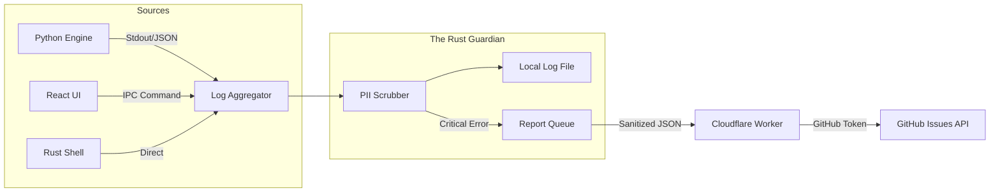

# Telemetry & Observability Strategy

> **Purpose:** Strategic architecture for error reporting, usage analytics, and logging while strictly adhering to the Privacy-First mandate.
> **Scope:** Data collection pipelines, scrubbing mechanisms, and storage policies.
> **Also read:** `anamnesis/strategy/architecture-overview.md` for master architecture.

---

## Executive Summary

Portfolio Prism implements a **"Privacy-Filtered, Zero-Effort Feedback Loop"**. The primary goal is to enable rapid iteration by automatically reporting errors directly to the developer's GitHub Issues, removing friction for the user. All telemetry aggregates in the Rust Shell, passes through a **PII Scrubber**, and is transmitted via a **Cloudflare Worker Proxy** that securely manages GitHub API authentication.

---

## 1. The Privacy Mandate

**Rule 1: No Financials.**
*   We never log portfolio values, trade amounts, or specific holdings quantities.
*   *Allowed:* "User synced portfolio with 15 assets."
*   *Forbidden:* "User bought 5 shares of AAPL at $150."

**Rule 2: No Identifiers.**
*   We never log emails, usernames, machine names, or IP addresses.
*   *Allowed:* Randomly generated `installation_id` (UUID).
*   *Forbidden:* `davidhelmus@gmail.com`.

**Rule 3: Transparency.**
*   Local logs are plain text and easily accessible to the user via "Open Debug Logs" button.
*   Automatic reporting requires initial "Opt-In" (e.g., "Help improve Prism by sending anonymous crash reports").

---

## 2. The Unified Pipeline Architecture

### **1. React Layer (The Face)**
*   **Mechanism:** Custom `logger` utility wrapping `console.log` + Error Boundary.
*   **Transport:** Sends structured logs/errors to Rust via `tauri-plugin-log`.
*   **Trigger:** Unhandled React suspensions/errors trigger an immediate "Report" payload.

### **2. Python Layer (The Engine)**
*   **Mechanism:** Standard `logging` module configured to output JSON to `stdout`.
*   **Transport:** Rust captures `stdout`/`stderr` from the Sidecar process.
*   **Trigger:** `sys.excepthook` catches unhandled crashes and flushes them to Rust.

### **3. Rust Layer (The Shell)**
*   **Mechanism:** `tracing` or `log` crate.
*   **Responsibility:** Aggregates streams, applies PII Scrubbing, manages the **GitHub Reporting Queue**.

---

## 3. Automatic GitHub Reporting Strategy

**Objective:** Zero-effort reporting for the user. If the app crashes, the developer should know immediately.

### **The Reporting Flow**
1.  **Event:** A critical error occurs (Rust Panic, Python Exception, React Crash).
2.  **Capture:** Rust captures the stack trace and last 50 log lines.
3.  **Scrub:** The **PII Scrubber** aggressively redacts IPs, Paths, and Emails.
4.  **Send:** Rust sends a POST request to `https://api.portfolioprism.com/report` (Cloudflare Worker).
    *   *Payload:* `{ "error_hash": "a1b2...", "stack": "...", "logs": "..." }`
5.  **Proxy Logic (Cloudflare Worker):**
    *   **Auth:** Holds the `GITHUB_PAT` (Personal Access Token) securely.
    *   **Deduplication:** Searches GitHub Issues for `error_hash`.
    *   **Action:**
        *   *If Found:* Adds a comment: "Occurred again on version X.Y.Z".
        *   *If New:* Creates a new Issue with the stack trace and logs.

### **User Experience (UX)**
*   **Background:** If "Always send crash reports" is ON, this happens silently.
*   **Foreground:** If OFF, a dialog appears: "Prism crashed. Send report?" (One click).
*   **Manual:** "Report Bug" button in Settings allows user to type a message + attach sanitized logs automatically.

---

## 4. The PII Scrubber

The Scrubber is a Rust middleware that runs *before* data writes to disk or cloud.

**Scrubbing Rules:**
1.  **Regex Replacements:** Detect and mask Emails, IPs, File Paths (`/Users/david/...` -> `$HOME/...`).
2.  **Allow-list Keys:** Only specific JSON keys (e.g., `error_code`, `duration_ms`, `component`) are passed. Unknown keys are dropped or hashed.
3.  **Financial Masking:** Any detected currency symbols or numbers looking like trade volumes are masked.

---

## 5. Telemetry Categories

### **A. Operational Logs (Debug)**
*   **Retention:** Local only (7 days).
*   **Content:** Full stack traces, verbose logic flow.
*   **Purpose:** User debugging ("Send me your logs").

### **B. Crash Reports (GitHub Issues)**
*   **Retention:** GitHub Repo (Indefinite).
*   **Content:** Stack trace + Minimized Context + Error Hash.
*   **Trigger:** Unhandled exceptions/panics.
*   **Mechanism:** Cloudflare Worker Proxy.

### **C. Usage Analytics (Optional)**
*   **Retention:** Cloud (Aggregate).
*   **Content:** Event-based (`app_opened`, `sync_completed`).
*   **Purpose:** Product decisions ("Do people use the X-Ray tab?").
*   **Status:** Lower priority than Crash Reporting.

---

## 6. Implementation Roadmap

### **Phase 1: Local Visibility (MVP)**
*   Implement `tauri-plugin-log` to unify React/Rust logs.
*   Configure Python to emit JSON logs to stdout.
*   Ensure all logs write to `~/Library/Application Support/PortfolioPrism/app.log`.

### **Phase 2: The Scrubber & Proxy (v1)**
*   Implement the Rust filtering logic.
*   Deploy Cloudflare Worker with GitHub Token.
*   Implement "Report Bug" button (Manual Trigger).

### **Phase 3: Auto-Reporting (v1.5)**
*   Hook up Global Error Handlers (Rust Panic, Python Exception).
*   Implement Hash-based Deduplication in Cloudflare Worker.
*   Add "Opt-In" toggle in Onboarding.

---

## 7. Success Metrics

*   **Zero-Friction:** User doesn't need to find log files or login to GitHub.
*   **Deduplication:** 100 crashes result in 1 Issue + 99 Comments, not 100 Issues.
*   **Privacy:** No PII ever reaches the GitHub Issue body.
