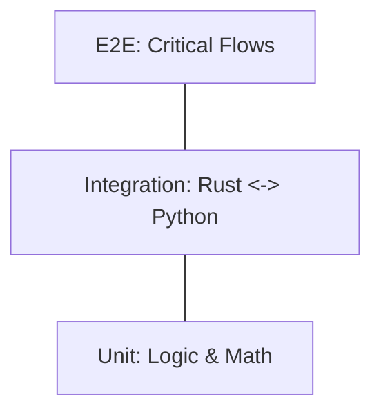

# Testing Strategy

> **Purpose:** Strategic architecture for ensuring system reliability, data correctness, and regression prevention across the three-language stack.
> **Scope:** Testing frameworks, coverage requirements, and automation pipelines.
> **Also read:** `anamnesis/strategy/architecture-overview.md` for master architecture.

---

## Executive Summary

Portfolio Prism employs a **"Pyramid Testing Strategy"** tailored for its hybrid architecture. We prioritize **Unit Tests** in each language for rapid feedback, **Integration Tests** at the Rust/Python boundary for system stability, and minimal **E2E Tests** for critical user flows. The goal is to catch 90% of bugs before they reach the UI, ensuring financial accuracy and app stability.

---

## 1. The Testing Pyramid

### **Level 1: Unit Tests (70% of Effort)**
*   **Python (The Engine):**
    *   **Tool:** `pytest` + `pytest-benchmark`.
    *   **Focus:** Financial math correctness, DataFrame transformations, Data Contract validation.
    *   **Mocking:** All API calls (`Decomposer`) and DB reads (`SQLite`) must be mocked.
    *   **Snapshots:** Use `syrupy` to verify Data Contract JSON outputs match expected schemas exactly.
    *   **Goal:** Prove `Input X -> Output Y` is mathematically correct and consistent.
*   **Rust (The Shell):**
    *   **Tool:** `cargo test` + `insta` (snapshot testing).
    *   **Focus:** IPC command handling, Process spawning, Configuration parsing, Telemetry scrubbing.
    *   **Goal:** Prove the "supervisor" behaves correctly.
*   **React (The Face):**
    *   **Tool:** `vitest` + `react-testing-library`.
    *   **Focus:** Component rendering, State updates (Zustand), User interaction handling.
    *   **Goal:** Prove the UI reflects the state correctly.

### **Level 2: Integration Tests (20% of Effort)**
*   **The Critical Boundary:** Rust <-> Python.
*   **Scenario:** Rust spawns the Python Sidecar, sends a JSON command (via `stdin` or CLI arg), and asserts the JSON response (via `stdout`) matches the schema.
*   **Tool:** Rust `cargo test` harness spawning the real Python binary.
*   **Database:** Uses a temporary, in-memory SQLite database populated with fixture data.

### **Level 3: End-to-End (E2E) Tests (10% of Effort)**
*   **Tool:** `Playwright` (via Tauri Driver).
*   **Scope:** "Smoke Tests" only.
    1.  App launches successfully.
    2.  "Sync" button clicks without crashing.
    3.  Data table renders > 0 rows.
*   **Why Minimize:** E2E tests are slow and brittle. We rely on Unit/Integration for correctness.

---

## 2. Test Data Strategy

### **Financial Fixtures**
*   **Problem:** Real financial data changes daily. Tests cannot rely on live API calls.
*   **Solution:** **"Frozen Time" Fixtures.**
    *   A set of static CSV/JSON files representing a "snapshot" of a portfolio (e.g., `simple_portfolio_snapshot.json`).
    *   Tests run against this snapshot to ensure deterministic calculations.

### **Database Fixtures**
*   **Mechanism:** Python `pytest` fixtures that create a temporary SQLite DB with known schemas and seed data before each test.

---

## 3. Performance Regression Testing

Given the strategic focus on **Vectorization** and **Parallelism**, performance must be guarded by tests.

*   **Tool:** `pytest-benchmark` (Python).
*   **Metrics:** 
    *   `Decomposer` fetch time (mocked latency).
    *   `Aggregator` calculation time (10k rows).
*   **Rule:** Fails if performance degrades by > 20% vs baseline.

---

## 4. Automation & CI/CD

### **The "Pre-Commit" Check**
*   **Local:** Developers run `just test` (or `npm run test`) which executes:
    1.  `cargo test` (Fast)
    2.  `pytest` (Fast)
    3.  `vitest` (Fast)
*   **Rule:** No commit if unit tests fail.

### **The GitHub Actions Pipeline**
1.  **Build Stage:** Compile Rust & Python.
2.  **Unit Test Stage:** Run all 3 unit test suites in parallel.
3.  **Integration Stage:** Run Rust-Python integration tests.
4.  **E2E Stage:** (Only on Main/Release branch) Run Playwright smoke tests.

---

## 5. Success Metrics

*   **Coverage:** >80% code coverage for Python Analytics Engine (Financial correctness is paramount).
*   **Speed:** Full Unit Test suite runs in < 30 seconds locally.
*   **Stability:** CI flakiness < 1%.
*   **Performance:** Aggregation logic stays within 50ms budget for standard fixtures.

---

## 6. Implementation Roadmap

### **Phase 1: Foundation (Immediate)**
*   Set up `pytest` with 100% mock coverage for the `Decomposer`.
*   Set up `vitest` for React components.
*   Create the "Golden Dataset" (static fixture for calculation verification).
*   Configure `pytest-benchmark` baseline.

### **Phase 2: Integration (v1)**
*   Write the Rust test harness to spawn the Python process and verify IPC contracts.

### **Phase 3: Automation (v1.5)**
*   Configure GitHub Actions for the full pipeline.
