# Pipeline State Machine - Mermaid Diagrams

> **Generated:** 2026-01-11  
> **Companion to:** `PIPELINE_STATE_MACHINE.md`

---

## High-Level Pipeline Flow

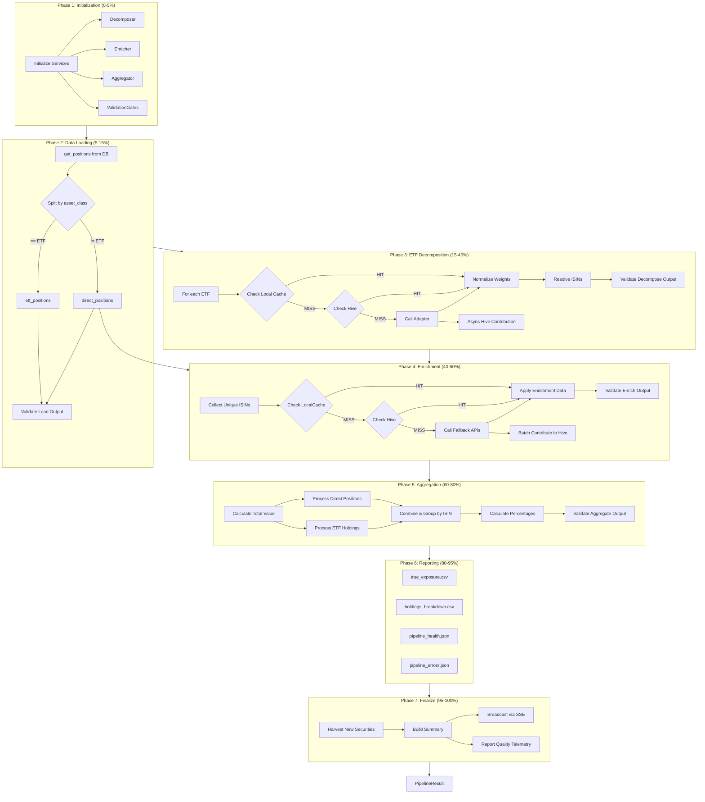

---

## ETF Decomposition Detail

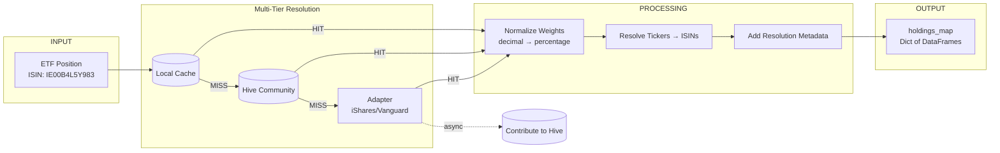

---

## Enrichment Flow

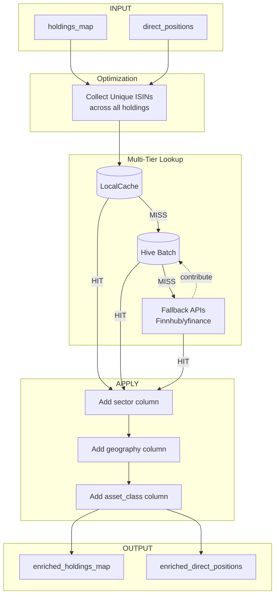

---

## Aggregation Logic

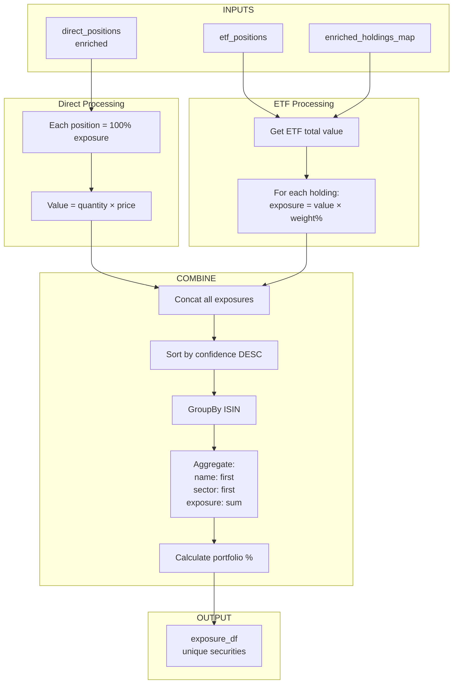

---

## Validation Gates

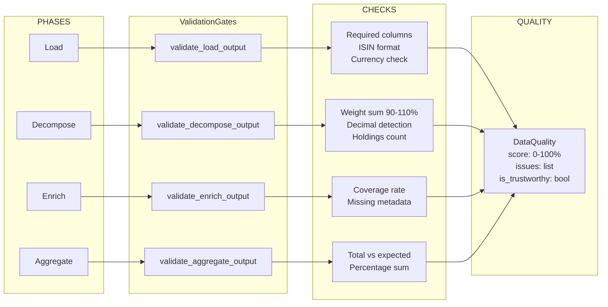

---

## Data Flow Overview

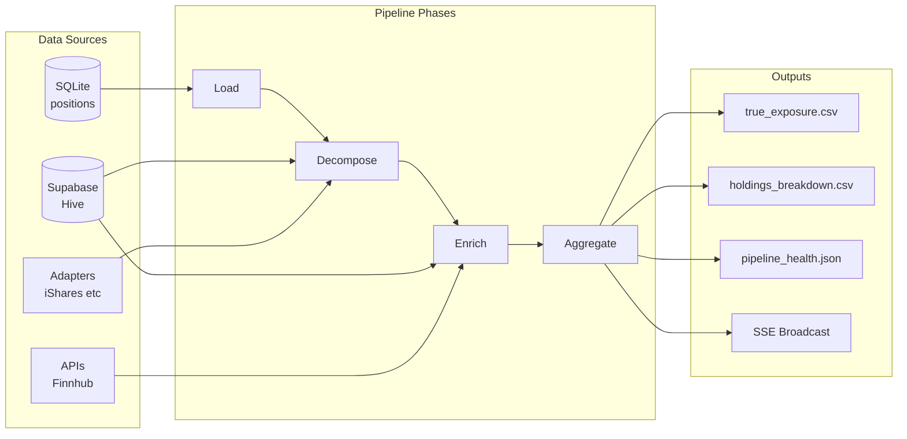

---

## Error Handling State Machine

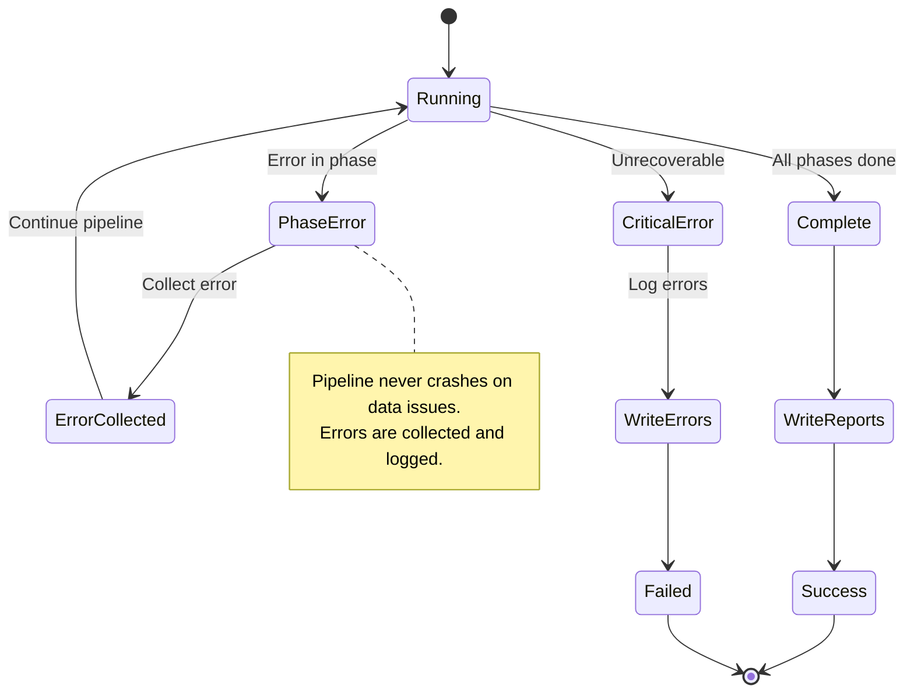

---

## Component Architecture

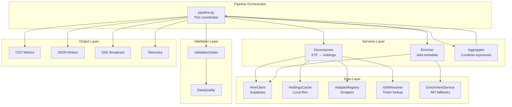

---

## Pipeline Phases Timeline

```mermaid
gantt
    title Pipeline Execution Phases
    dateFormat X
    axisFormat %s

    section Initialization
    Init Services           :0, 5

    section Data Loading
    Load Portfolio          :5, 15

    section Decomposition
    Decompose ETFs          :15, 40

    section Enrichment
    Enrich Securities       :40, 60

    section Aggregation
    Aggregate Exposures     :60, 80

    section Reporting
    Write Reports           :80, 95

    section Finalize
    Harvest & Broadcast     :95, 100
```

---

## Issue Severity Levels

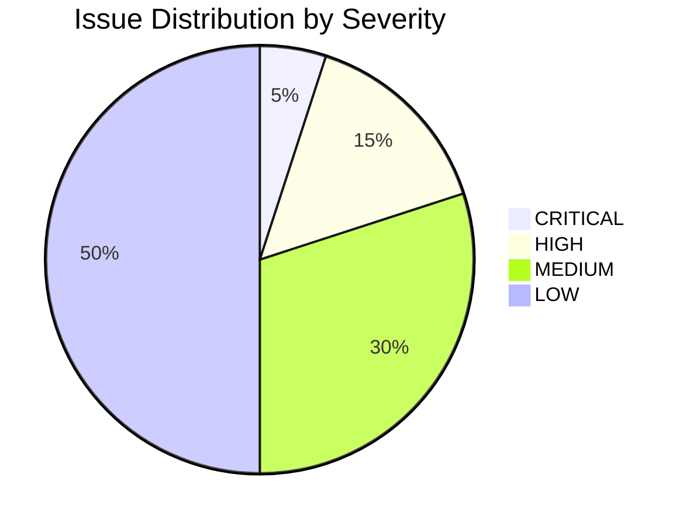

---

## Multi-Tier Resolution Strategy

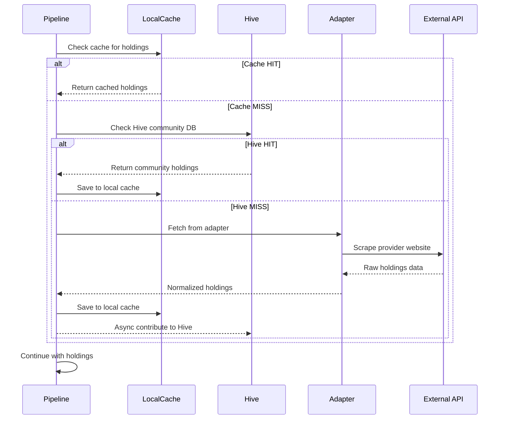
