# Portfolio Prism: Tauri Application Design Document v3.0

## 1. System Overview

**Product**: Portfolio Prism Desktop App
**Platform**: macOS (native via Tauri), Windows/Linux compatible.
**Core Value**: A privacy-first, high-performance portfolio analyzer.

### High-Level Architecture
The application follows the **Sidecar Pattern**, combining a lightweight native shell with a powerful Python analytics engine. **Crucially, it is 100% "Battery Included" but "Browser Free" (no bundled Chromium).**

```mermaid
graph TD
    User["👤 User"]
    subgraph "Desktop App (Tauri)"
        NativeUI["🖥️ Native Shell (Rust/JS)"]
        Sidecar["🐍 Python Sidecar (Streamlit/FastAPI)"]
        LocalDB["📂 Local Data (App Support)"]
    end
    
    subgraph "Cloud Services"
        Proxy["🛡️ Cloudflare Proxy (API Gatekeeper + Feedback)"]
        Supabase["☁️ Supabase (Community DB)"]
        UpdateServer["🔄 Update Server (GitHub Releases)"]
        GitHub["🐙 GitHub Issues (Bug Tracker)"]
    end
    
    User --> NativeUI
    NativeUI --"JSON-RPC / HTTP"--> Sidecar
    Sidecar --> LocalDB
    Sidecar --> Proxy
    Sidecar <--> Supabase
    Proxy --> GitHub
    NativeUI <--> UpdateServer
```

---

## 2. Core Logic & Data Flow

### 2.1. Application Lifecycle & Handshake
1.  **Launch**: Tauri starts. Checks for `~/.portfolio-prism.lock` to prevent multiple instances.
2.  **Spawn**: Tauri spawns the Python binary.
3.  **Handshake (Robust)**:
    *   Python starts Streamlit on port `0` (random free port).
    *   Python prints structured log: `{"event": "server_started", "port": 12345}`.
    *   Tauri listens to `stdout`, parses JSON, and redirects main window to `http://localhost:12345`.
4.  **Shutdown**: Closing window sends `SIGTERM` to Python. Python performs cleanup (DB commit) and exits.

### 2.2. Data Storage & Migration strategy
**Location**:
*   **Old**: `./data/` (Root of repo).
*   **New**: `~/Library/Application Support/PortfolioPrism/` (macOS Standard).

**Migration Logic (On Boot)**:
1.  Check if `New` directory exists.
2.  If NO check if `Old` directory exists (e.g. from previous manual install).
3.  If YES, move files to `New`.
4.  If NO, initialize empty DB schema.

### 2.3. Trade Republic Authentication (The 2FA Flow)
The previous CLI flow must be adapted to UI.

**Flow**:
1.  **Screen 1**: "Connect Trade Republic". Inputs: Phone, PIN.
2.  **Action**: App calls `pytr.login(phone, pin)`.
3.  **State**: App enters `WAITING_FOR_2FA`. UI shows: "Check your phone giving code...".
4.  **Screen 2**: "Enter Code". Input: 4-digit numeric field.
5.  **Action**: App completes handshake. Saves `pytr` credentials to **Keyring** (not plain text `.env`).

---

## 3. The "Hive Mind" (Replacing Playwright)

**Decision**: We **REMOVE** Playwright to save ~300MB and improve stability.
**New Strategy**: "Community First, Manual Fallback".

1.  **Primary**: **The Hive**. App checks Supabase `master_universe` for ETF holdings (crowdsourced).
2.  **Secondary**: **Manual Upload**. If ETF is unknown, user is prompted: *"We don't know this ETF yet. Please upload the CSV from the provider's website."*
    *   This uploads the interpretation to the local DB *and* queues it for contribution to the Hive.
3.  **Deprecation**: The `scrape_holdings()` functions will be disabled in the Desktop build.

---

## 4. Resilience & Offline Mode

**Philosophy**: "Local First. Cloud Optional."

### Scenarios
*   **No Internet**:
    *   **App**: Starts normally.
    *   **Data**: Loads last known portfolio state from `LocalDB`.
    *   **UI**: Shows "Offline Mode" badge. Pricing data uses last cached close.
    *   **Actions**: "Sync", "Enrich", and "Contribute" buttons disabled.
*   **API Failure (Finnhub/Proxy)**:
    *   Retries 3 times with exponential backoff.
    *   If fails: Silently falls back to cached data. Logs error to `debug.log`.
    *   UI: "Some prices may be outdated."

---

## 5. Updates & Maintenance

**Technology**: `tauri-plugin-updater`.

**Workflow**:
1.  **Build**: GitHub Actions builds `.dmg` and `.app.tar.gz`.
2.  **Release**: Pushes artifacts to a GitHub Release (v1.0.1).
3.  **Check**: App checks `https://api.github.com/repos/.../releases/latest` on launch.
4.  **User Prompt**: "New version available. Update now?"
5.  **Apply**: Downloads, swaps binary, restarts.

---

## 6. Feedback Loop (Automated Bug Reporting)

**Goal**: Tight feedback loop for MVP. Users encounter a bug -> GitHub Issue created automatically (or with 1 click).

### 6.1. Architecture
*   **Client**:
    *   **Global Exception Hook (Python)**: Catches unhandled exceptions.
    *   **Panic Hook (Rust)**: Catches native crashes.
    *   **Feedback Button**: Floating action button in UI "🐛 Report Bug".
*   **Proxy (Cloudflare Worker)**:
    *   Endpoint: `POST /feedback`
    *   Secret: `GITHUB_PAT` (token with `repo` scope).

### 6.2. Workflow
1.  **Crash/Report**: App captures stack trace + OS Version + App Version.
2.  **Sanitization**: **CRITICAL**. Regex filter removes:
    *   Phone numbers (Trade Republic).
    *   PINs.
    *   File paths (containing username).
3.  **Transmission**: JSON payload sent to `https://proxy.prism.app/feedback`.
4.  **Issue Creation**:
    *   Worker receives payload.
    *   Calls GitHub API to create issue in `Skeptomenos/Portfolio-Prism`.
    *   Adds labels: `bug`, `auto-report`, `v1.0.1`.
    *   (Optional) Checks for duplicates by hashing the stack trace.

### 6.3. User Consent
*   **Feedback Button**: Explicit consent (User types message).
*   **Auto-Crash**:
    *   MVP: "Silent" (Friends only alpha).
    *   Public Release: Prompt "App crashed. Send report?"

---

## 7. Authentication (Community Features)

**Technology**: `streamlit-authenticator` (Local UI) + Supabase Auth API (Backend).

*   **Login**: Simple username/password form in Streamlit sidebar.
*   **Session**: JWT token stored in `st.session_state` and persisted to `token.json` in App Support (encrypted).
*   **Gate**: Only required for *uploading* new ETF definitions to the Hive.

---

## 8. Implementation Roadmap

### Phase 1: Core Shell & Migration
*   [ ] Init Tauri.
*   [ ] Implement `DataMigration.py`.
*   [ ] Implement `PortHandshake` (Rust <-> Python).

### Phase 2: Auth & 2FA
*   [ ] Create `TradeRepublicLogin.py` Streamlit page.
*   [ ] Link `pytr` async loop to Streamlit UI loop.

### Phase 3: The Hive & De-bloat
*   [ ] Remove Playwright dependency.
*   [ ] Build `HiveSync` client (Supabase).
*   [ ] Build "Manual Fallback" UI for missing ETFs.

### Phase 4: Feedback Loop
*   [ ] Extend Proxy (Cloudflare) with `POST /feedback`.
*   [ ] Implement Python `excepthook` for auto-reporting.
*   [ ] Add "Report Issue" button in Streamlit.

### Phase 5: Polish & Release
*   [ ] Add `Updater` logic.
*   [ ] Sign & Notarize.

## 9. Verification Plan

*   **Smoke Test**: Clean install on fresh macOS VM. Assert app launches and creates `AppSupport` folders.
*   **Migration Test**: Place v0.1 data in `./data`, launch v1.0, verify data moved.
*   **2FA Test**: Log in with real Trade Republic account, verify 2FA prompt appears and works.
*   **Offline Test**: Disconnect Wifi, launch app. Verify dashboard loads with cached data.
*   **Bug Report Test**: Manually trigger an exception (dev button). Verify GitHub Issue appears in repo.
