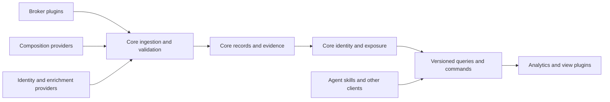

# Plugin architecture

Status: adopted target design, 2026-09-20. This defines intended boundaries; it does not claim that a plugin SDK or loader exists. Read the [project index](../index.md) for delivery status and the [V2 README](../v2/README.md) for implemented behavior.

For a visual explanation of the current runtime, pipeline and this target, open the [architecture map](architecture-map.html). The map labels implementation separately from adopted design.

## Purpose

Users can extend Portfolio Prism with broker connections, ETF composition sources, enrichment, analytics and views. First-party integrations use the same contracts as contributed extensions. Contributions improve shared capabilities; private portfolio data is not a prerequisite for contributing.

The core owns the meaning and integrity of portfolio results. Plugins acquire and interpret external data or add analyses and presentation. Modularity stays within the agreed TypeScript/Effect, React/Vite and SQLite application; it does not require microservices or an LLM in the refresh loop.

## One plugin model, typed capabilities

A plugin has one stable identity, version and host compatibility declaration. It contributes one or more typed capabilities: broker, composition, enrichment, analytics or view. Each contribution has a stable local ID and a capability contract version. For example, one ETF source plugin can contribute both a composition provider and a source-inspection panel. Users and contributors should not need separate, unrelated plugin systems for those two features.

Use explicit registration for bundled plugins, including first-party integrations. The host validates plugin and contribution IDs, versions and required capabilities before activation. Introduce executable capability contracts as real features exercise them; naming a future capability does not imply that it is implemented or available.

Shared metadata is not a universal interface. Each capability receives a narrow host context:

| Capability | Host context |
| --- | --- |
| Broker | Connection-scoped authentication, bounded acquisition and normalized observation submission |
| Composition | Approved source requests, evidence retention and typed candidate/inspection submission |
| Enrichment | Scoped evidence queries and proposals for identities or other observations |
| Analytics | Versioned read models and a separate derived-result surface |
| View | Versioned read models, supported commands, navigation and presentation services |

A view does not inherit a provider's network or credential access because they belong to the same plugin. Backend and frontend entry points remain separate so the browser does not import provider execution or secrets. Capability contexts make dependencies explicit; trusted bundled code is not thereby sandboxed.

## Core, host and plugin responsibilities

| Area | Plugin responsibility | Core / host responsibility |
| --- | --- | --- |
| Broker connector | Provider authentication workflow; fetch positions, cash and quotes; translate provider formats into typed observations | Core: connection/account identity, snapshot acceptance, history and valuation policy. Host: scoped credential custody and authentication orchestration |
| Composition provider | Discover publications, acquire holdings, parse formats, identify the exact fund/share class and report units, basis and source limits | Validate evidence and semantics, select eligible datasets, preserve gaps and calculate exposure |
| Identity/enrichment provider | Supply evidenced identifiers, security-to-company relationships, classifications, prices or FX observations | Canonical identities, effective dates, conflicts, corrections and rules for combining records |
| Analytics extension | Derive metrics or scenarios from versioned read models; declare method, inputs and limitations | Canonical exposure, contribution ledger and coverage definitions; keep derived results distinct |
| View extension | Register pages or panels; render read models and invoke supported commands | Host: navigation, theming and accessibility. Core: connection/data status and canonical provenance/coverage models for shared presentation |

The core owns SQLite schema migrations, transactions, accepted records, evidence references, backups and replay. A plugin may request namespaced state through a host interface. It cannot mutate core tables or mark its own inputs as accepted exposure.

The [history and performance extension](portfolio-history-and-performance.md) makes these responsibilities concrete: broker capabilities submit dated observations; core owns immutable revisions and calculation checkpoints. Host schedules source checks and reuses accepted evidence. The current broker contract isolates connection state and normalized observations. Financial views consume [versioned projections](financial-view-contract.md), and Contribution mix demonstrates a separately registered analysis without rewriting canonical results. Transaction/event normalization, cash-flow reconciliation, cost/return methods and general SDK publication remain later increments. Bundled modules are trusted code; these contracts do not establish arbitrary-plugin isolation.

The application host owns registration, configuration, scheduling, cancellation, retry/rate budgets, operation diagnostics and delivery to the UI. It supplies the capability contexts and invokes core acceptance and recalculation. The core retains duplicate/selection rules and all financial decisions. Plugins declare source constraints and translate formats; the host is not another financial engine.

These are module boundaries within one application. Keep shared contracts, financial core, operational host and plugin implementations distinguishable; move touched code incrementally. A package split or repository-wide move is not required.

## Provider contract

Use **composition provider**, not scanner: HTTP APIs, downloadable files, scrapers and explicit imports are alternative acquisition methods. One plugin can support many funds through profiles. A new ETF needs a new plugin only when its source behavior requires one.

The initial contract must cover these facts without inventing unsupported evidence:

- Stable provider ID, plugin version, contract version and declared capabilities.
- Connection/account scope for broker records; fund and share-class scope for composition records. Preserve security, listing and company as separate identities. Keep source-scoped identifiers where a reliable global identifier is absent.
- Acquisition result and completeness: complete snapshot, partial response, authoritative empty result, unchanged publication or failure. A failed/partial read must not imply a sold position or empty fund.
- Source locator, retrieval time, source/publication/composition dates, original payload or permitted replay material, content hash, parser version and access/retention constraints. Missing dates remain missing.
- Decimal values with explicit units, currencies and weight basis. Preserve equity, cash, derivatives, signed rows and rejected rows; explain the measure supported by the source.
- Typed diagnostics and next action, cancellation and bounded resources. Diagnostics exclude secrets and private raw account data.

Providers return candidates and evidence. Core policies decide eligibility and select one compatible composition for each fund and measure. Competing sources and corrections must not silently double-count the same holding. Same-ISIN evidence is distinct from an evidenced relationship between different securities and one company.

Provider-specific format rules remain in the provider. Generic invariants and admission decisions remain in the core. Source-specific policy profiles may supply evidence and constraints, but cannot bypass shared checks.

## Financial and operational invariants

- Apply every supported accepted input to persistence, calculations and relevant views in the same delivery increment. An SDK milestone does not justify leaving usable data unused.
- Preserve original units and decimal precision. Never rescale incomplete weights to 100%, infer company identity from a name/ticker alone, or apply a second currency conversion.
- Keep input versions, source dates, hashes, identity/policy decisions and valuation basis traceable from each contribution. Offline replay uses those saved inputs and versions.
- Expose what is missing, why it is missing, and the data or implementation needed next. Distinguish missing acquisition, failed validation, unresolved identity and usable data awaiting integration.
- On refresh failure or plugin removal, preserve accepted historical data and provenance. Show inactive/stale source state. A plugin failure must not erase another connection or provider's records.
- Preserve measure labels. A supported issuer-allocation estimate does not claim full NAV/economic reconciliation or complete company identity coverage.

## Host, compatibility and trust

Begin with reviewed, bundled modules and explicit registration through the shared plugin descriptor. Its metadata describes ID, version, supported host/contract versions and typed contributions; configuration and entry points belong to the capabilities that need them. The initial implementation needs only fields exercised by the first integrations; avoid a speculative framework.

The host validates registrations and rejects duplicate IDs or incompatible versions before starting work. It owns configuration, activation, stop/cancellation and diagnostics; the core owns accepted-data migrations. Namespaced plugin state has its own version and recovery path. Credential access is scoped to the configured connection and operation; credentials never enter analytic read models or fixture exports.

Use one consistent registration source for provider refresh, persistence and restart replay. A disabled or failed capability stops new work without deleting accepted history or disabling unrelated capabilities. Shared lifecycle conventions must cover activation failure, cancellation, restart, disable and version incompatibility. Do not require every capability to implement irrelevant lifecycle hooks.

Bundled modules run as trusted application code. TypeScript interfaces and declared permissions are not a sandbox. Independently installed code requires enforced isolation and permissions for backend execution and frontend rendering, including network, file, credential and portfolio-data access. Do not advertise that protection before it is implemented and tested.

Updating or disabling a plugin must preserve an understandable last-known result. When replay requires an older parser or contract, retain a supported decoder/migration path or report the incompatibility; do not silently reinterpret saved evidence.

## Analytics, views and agent skills

Expose stable read models for positions, contributions, sources, identities, coverage and diagnostics. Views consume these contracts rather than SQLite or provider payloads. Register routes/panels explicitly; retain the shell's navigation and interaction conventions.

An analytics extension declares its method/version and input snapshot. It cannot overwrite canonical exposure or present incomplete inputs as complete. First-party Breakdown and contributed views must preserve the same sources, dates and coverage distinctions.

The first public Extend skill is the [composition-provider workflow](../skills/portfolio-prism-composition-provider/SKILL.md). It covers the exercised bundled provider path; it does not imply the remaining SDK and broker/view conformance work is complete.

Publish two agent skill families with the public extension documentation:

1. **Operate Prism:** connect/synchronize, refresh, query exposure, inspect source health and explain the next action for gaps through supported commands.
2. **Extend Prism:** scaffold a provider or view, implement the contract, run conformance tests, use redistributable fixtures and prepare a reviewed contribution.

Skills use the same versioned CLI/API as other clients. An MCP may later expose those operations; it is a transport, not a separate calculation engine. Research agents can investigate a source, but ordinary refresh remains deterministic and browser-free for providers that support direct acquisition.

Public documentation and examples must survive the split repository. Private planning, credentials, portfolio snapshots and source data without redistribution rights stay outside that contribution package.

## Proof of extensibility

Plugin support is delivered when representative extensions demonstrate the boundaries:

- A second source with materially different behavior can be added through a provider module/profile and registration without editing core financial logic.
- One plugin contributes a provider and a useful registered panel through the same descriptor. Its panel uses public read/command contracts, receives no provider credentials, and preserves canonical coverage and provenance.
- A broker produces normalized observations without adding its raw formats to valuation or snapshot code; connection namespaces and partial failures preserve unrelated accounts.
- A new analytics view consumes supported read models and registers navigation without changing core calculation or storage.
- Conformance checks cover malformed inputs, incompatible versions, identity/date/unit mismatches, partial/empty results, duplicates, cancellation, replay and last-good recovery as applicable.
- Built-in behavior remains numerically equivalent for the same supported inputs, and the real user journey exposes newly accepted data and unresolved gaps.

The delivery plan decides when each proof is due. Implement the common model with the second source, then prove view and broker capabilities, then publish the exercised contributor package. Defining this architecture alone does not satisfy those proofs. Plugin extensibility and complete financial coverage are separate acceptance gates; neither substitutes for the other.
