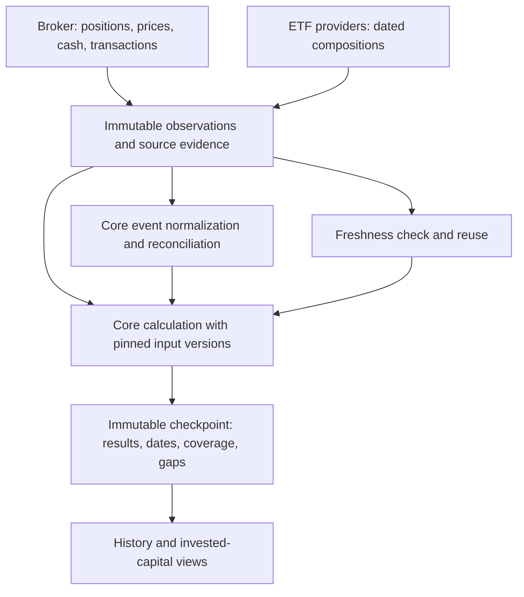

# Portfolio history, invested capital and returns

Status: accepted implementation direction, 2026-09-21. This document owns the target data and financial contracts. H1 now implements immutable observations and checkpoints with a minimal history view; H2 adds a bounded event ledger and Transactions view, while complete statement reconciliation, interactive timelines and performance measures remain open. Implementation acceptance and merge are separate; use the project index for delivery state. The [runtime guide](../v2/README.md) owns current behavior; the [project index](../index.md) routes to delivery status. Keep the TypeScript/Effect, React/Vite and SQLite stack and the [plugin boundaries](plugin-architecture.md). The initial [H1 API contract](history-api-contract.md) coordinates parallel backend and view implementation.

## Questions the product should answer

| Question | Required evidence |
| --- | --- |
| What did I hold and what was it worth at each sync? | Dated quantities, compatible prices/currencies, cash, and immutable calculation inputs/results |
| How much did I buy or sell? | Executed transactions with quantities, execution prices and cash legs; snapshots alone are insufficient |
| How much money did I add or take out? | External deposits, withdrawals and valued security deliveries across a declared account boundary |
| How much did my investments earn? | Comparable opening/closing valuations and complete external flows for that period |
| What is my gain on a particular stock? | Position values, its trades/income/costs, corporate actions and, for realized/unrealized splits, evidenced acquisition lots |
| Why did company exposure change? | Position/price changes, ETF composition versions and identity changes, separately attributed from data corrections |

## Pre-H1 baseline and remaining pieces

At the pre-H1 code audit (`a1fa3e17`, 2026-09-21), [the store](../v2/server/store.ts) appends holdings snapshots and retains accepted dated composition/inspection versions. It overwrites the latest broker source envelope for quotes, cash and instrument metadata. [Broker history extraction](../v2/server/explorer.ts) merges paginated events and details, but is not a normalized financial ledger. [The service](../v2/server/service.ts) calculates from selected latest inputs; it does not freeze a reproducible portfolio result for every run. Bounded diagnostic retention is not business history.

H1 has since added immutable observations, run/checkpoint references and frozen results to that database. H2 now adds a connection-scoped ledger, source revisions and a registered Transactions view. Its reconciliation stays explicitly incomplete pending statement-period evidence; no replacement database or general event-sourcing platform is needed. Recoverable old holdings/compositions must stay available, but missing historical quotes, cash or transactions cannot be reconstructed from today's values.

## Separate observations, events and results

These are logical records; implementation may extend existing tables. Do not prescribe a new table per box.

| Record | Minimum retained information |
| --- | --- |
| Observation | Dataset/connection/account identity, kind, immutable ID, effective/source date, observed/retrieved time, completeness, original decimal units, safe source evidence/hash and parser version |
| Financial event revision | Source event ID and revision, account/security identity, type/status, trade/effective and settlement times when known, quantity and signed currency legs, fees/taxes/income, related transfer/action IDs, source references and normalization version |
| Operation | Trigger, start/end, success/partial/failure/cancellation, observation/checkpoint references and safe diagnostic IDs; persists independently of diagnostic pruning |
| Calculation checkpoint | Scope and cutoff, exact input/event revisions, selected compositions, identities, FX, policy/calculator versions, result schema, unrounded results, dates, coverage and gaps |
| Source check | Attempt/result, checked time, selected evidence reference, last successful check and next eligible check; an unchanged result need not duplicate the evidence blob |

Keep source effective time separate from when Prism learned the fact. Unknown timestamps remain unknown; preserve source timezone/precision rather than inventing intraday ordering. A same-date correction is a new candidate revision with a link to its predecessor, never an overwrite. Content hashes deduplicate blobs, not business events: two equal-value purchases can be different trades. Provider/connection/account plus source event identity prevent cross-account collisions. When stable identity is missing, record ambiguity for resolution instead of silently merging.

### Checkpoints during asynchronous sync

Persist accepted inputs before publishing their results. A holdings commit can produce a partial checkpoint with missing valuation evidence; successful valuation or composition batches produce subsequent checkpoints linked to the same operation or trigger. Each calculation pins a coherent set of committed input references in one SQLite read transaction, calculates from that frozen set, then atomically saves its manifest and result. Never reread mutable “latest” inputs halfway through calculation.

Inputs may have different source dates; the manifest exposes this and valuation policy still decides compatibility. A concurrent update schedules a new calculation. A failed attempt records failure and leaves the last useful checkpoint intact; it does not fabricate a new market observation. Serialize checkpoint publication or guard the live selection by input generation so a slower old calculation cannot replace a newer result. One failed provider must not block useful results from another.

The default history view is **as recorded then**. **Recomputed with later evidence** creates a separately labelled revision referencing the original checkpoint and correction reason. Later prices, compositions or identity decisions must never leak silently into an old chart point. Retain frozen results and normalized inputs for display even if a plugin decoder becomes unavailable; mark replay unavailable until a compatible decoder exists.

## Quantities are not transactions

Ten shares at one sync and twelve at the next prove a net increase of two observed units. They do not prove a purchase of two shares, its execution price or invested amount. Transfers, splits, mergers, reversals and missing data can change units. An unchanged quantity can hide a buy followed by a sell.

Normalize evidenced executed trades, external cash transfers, security deliveries, dividends, interest, fees, taxes, FX exchanges and corporate actions. Pending/cancelled orders do not become executed trades. Keep unresolved events visible. Preserve gross consideration and net settlement separately, with each fee/tax counted exactly once. Respect provider `fractionDigits` and currencies; a displayed integer is not automatically euros.

Reconcile each account/security between compatible snapshots:

`closing quantity = opening quantity + buys - sells + deliveries in - deliveries out + evidenced corporate-action adjustments`

Reconcile cash separately from trade and non-trade currency legs. Pair internal transfers so consolidated accounts do not count both legs as funding. Record settlement timing and receivables/payables when required; an unexplained settlement difference is a gap. A quantity/cash residual does not become an invented balancing trade or market gain.

History completeness needs a declared start/end, pagination/detail outcomes and reconciliation evidence. An exhausted API cursor does not prove all account history exists. Use broker statements or explicit, sourced opening balances/lots where the API is insufficient. Opening holdings establish a starting valuation, not how much was invested before that date.

The target normal sync acquires recent transaction changes within bounded budgets and resumes an initial backfill separately. Preserve pagination progress and retry missing details. A price/holdings refresh may finish before this work; show its transaction cutoff rather than claiming performance is current. Full personal/tax/document extraction is not required for financial history.

## Define invested money by scope

For a portfolio, include the declared securities **and cash accounts**, and any supported liabilities. Deposits/withdrawals and in-kind deliveries across that boundary are external capital flows. Purchases and sales within it exchange cash for securities. Retained dividends/interest are investment income; a later withdrawal is a separate flow. A transfer between two selected accounts is internal, while a transfer to an excluded account crosses the boundary. These scope distinctions follow the [Portfolio Performance cash-flow model](https://help.portfolio-performance.info/en/concepts/performance/money-weighted/#defining-the-cashflows).

Use specific labels:

| Label | Meaning |
| --- | --- |
| Cash added / cash withdrawn | Gross external cash flows during the selected period |
| Securities transferred in / out | In-kind boundary flows, valued at their effective time; unknown value blocks complete performance |
| Net capital added | External inflows minus external outflows, including valued deliveries |
| Purchases / sale proceeds | Executed gross trade consideration; show fees/taxes separately. Reinvesting proceeds increases purchases without increasing external funding |
| Remaining acquisition cost | Cost allocated to still-held lots under the declared method; not lifetime purchases or net capital added |
| Investment gain/loss | Value change after removing external capital flows for the same scope/period |

For fully valued, comparable period boundaries and complete flows:

`investment gain = closing portfolio value - opening portfolio value - net capital added`

Recommended initial convention: net of evidenced fees and taxes actually charged inside the scope, with both separately disclosed. This is account economics, not a tax filing calculation. Do not subtract a cost again when it already reduced cash. Historical acquisition cost is not required for this period-level gain if opening value and period flows are complete; it is required for lifetime cost-based or realized/unrealized claims.

Synthetic example: opening value **EUR 1,000**, deposit **EUR 500**, closing value **EUR 1,650** → **EUR 150 gain**, not EUR 650. Buying EUR 400 of shares from existing account cash is not another deposit. A return percentage additionally needs the timing of flows and a defined method.

### Per-security results and ETF look-through

Display quantity history, evidenced purchases/sales and supported price observations as soon as available. A quantity delta times a snapshot price is not actual purchase spending. Broker average buy-in remains an unreconciled source field until its currency, unit, action treatment and cost convention are verified.

For one security, distinguish price movement, income, realized gains on sold lots and unrealized gains on remaining lots. Corporate actions must preserve/allocate quantities and cost using evidence. Select and version a lot method before cost-based results are enabled; do not silently assume FIFO or imply tax accuracy. Missing opening lots can block realized/unrealized results while leaving an evidenced period-value comparison usable.

ETF constituents are indirect exposure, not shares the user purchased individually. Their weights can change because the fund rebalances. Never create personal NVIDIA trades or cost basis from a change in an ETF's NVIDIA weight. Historical look-through uses the checkpoint's dated composition, exposes its allocation limits, and separates source/identity changes from price and capital-flow changes. Keep ETF value and its constituents out of the same additive portfolio total.

### Return percentages and comparability

Publish monetary flows and gains before optional rates. Money-weighted return (XIRR) incorporates the timing and size of the investor's cash flows. Pin day-count, sign and annualization conventions; no valid or uniquely supported solution is an unavailable result, not a selected convenient root. Label short-period annualization explicitly. [Method reference](https://help.portfolio-performance.info/en/concepts/performance/money-weighted/).

Time-weighted return links subperiod returns while removing external-flow effects. Accurate flow-boundary valuations are needed; sparse sync snapshots alone do not establish it. Daily conventions or approximations must be separately named and evidenced before use. [Method and valuation requirements](https://help.portfolio-performance.info/en/concepts/performance/time-weighted/). These are methodological references, not a GIPS compliance claim.

Keep currencies separate until dated, evidenced FX supports opening values, closing values and event-time flows in a reporting currency. Use compatible quote types and security units; split-adjusted historical prices plus unadjusted quantities can create false gains. Do not multiply dividend-adjusted total-return prices and then add the same dividends again. Distinguish reported price, execution price and chosen valuation basis.

The existing **priced-securities coverage** denominator excludes cash and unvalued positions. It cannot be reused as complete portfolio performance. Broader company identity and every ETF constituent are not prerequisites for account-level gain if the owned ETF itself is fully valued; their gaps still limit company-level analysis. Changing coverage, adding an account or resolving a quote is not a market return. Preserve a fixed comparison scope, show missing endpoints/events, and offer an explicitly comparable subset where supported. Do not join chart gaps or claim a full-portfolio rate from that subset.

## Reuse, freshness and preservation

Use the last eligible saved composition immediately with its original publication date and stale/failed status. Broker sync and issuer checks are separate operations. Persist last attempt, last successful check, last accepted publication and next eligible check separately. Extend the host's current daily issuer eligibility policy with bounded failure backoff and explicit manual refresh; a broker sync does not require downloading every fund again.

Where a source supports reliable validators, use ETag/Last-Modified or a documented publication version before transferring the full body. A page date alone cannot prove the body is unchanged or detect a same-date correction. Record the method of checking; revalidate bodies at a bounded provider-specific cadence when validators are insufficient. Unchanged checks reuse content without rewriting its first retrieval time. Conflicting revisions remain inspectable and require core resolution; failed checks preserve accepted versions. Source access/retention rights remain a separate open finding.

Store history in the durable private SQLite location outside disposable worktrees. Keep credentials and signed access URLs out of history and exports. Make a SQLite-consistent backup including committed WAL state before additive migration; verify restore on a copy. Deduplicate evidence bytes, retain checkpoint references and do not prune referenced inputs silently. Retention/export controls can follow measured storage growth; do not adopt unlimited raw sensitive-data capture as the default. Persist only allowlisted observations needed for portfolio history, with their replay evidence and source constraints.

Migration imports surviving legacy records with known dates and completeness. Missing overwritten observations remain missing. The first reliable checkpoint is a visible history start; an opening baseline is not “total invested since account creation.” No backdated fictional snapshots or returns.

## Boundaries and presentation

Broker plugins submit typed observations and source-specific event candidates. Composition plugins supply publications and source-check capabilities. Core owns event revisions, reconciliation, financial methods, checkpoint selection and persistence. Host owns scheduling and recovery. Views/analytics consume versioned history models without querying raw provider payloads or altering canonical totals. Implement these boundaries incrementally through useful history, without waiting for a general plugin SDK.

The first view shows saved dates, values, cash, priced/unvalued coverage and sync outcomes. Then add **Value / Net capital added / Investment gain**, period/account/currency controls, and an expandable explanation of change. At security level show purchases, sales, income and cost-based results only where supported. Show missing transaction periods, missing valuations and unreconciled changes beside amounts, with the next required data or implementation. The [coverage contract](exposure-coverage-contract.md) continues to govern exposure; completeness of performance has its own period and input checks.

## Acceptance examples

| Case | Expected result |
| --- | --- |
| EUR 1,000 opening + EUR 500 deposit → EUR 1,650 closing | EUR 150 economic gain; no rate inferred from these three numbers alone |
| Buy EUR 400 from existing portfolio cash | EUR 400 purchase, zero external capital added; fees separately reduce net gain |
| Ten shares at EUR 100 become twenty at EUR 50 after a verified 2:1 split | Same EUR 1,000 value; no purchase or gain from the split |
| Buy and sell occur between syncs with unchanged final quantity | Both transactions retained; quantity delta does not suppress them |
| Dividend retained, then withdrawn | Income and withdrawal remain separate; neither is an investor deposit |
| Transfer between two included accounts; then exclude one account | Zero consolidated funding in the first scope; explicit boundary flow in the second |
| Missing quote later resolved or ETF source/identity updated | New data/checkpoint; not unexplained investment profit |
| Event duplicated, reversed or corrected after an earlier checkpoint | Idempotent ingestion and new revision; old recorded result remains reproducible |
| One source fails, concurrent refresh completes, then restart offline | Useful committed checkpoints survive; newest eligible result remains selected |
| Incomplete transaction history, absent FX or unknown transferred value | Supported observations/flows shown; affected complete gain/rate unavailable with next action |

Research references were read on 2026-09-21. All monetary examples above are synthetic. Implementation acceptance must also use private saved broker evidence and the actual browser journey; synthetic arithmetic alone does not close broker reconciliation.
