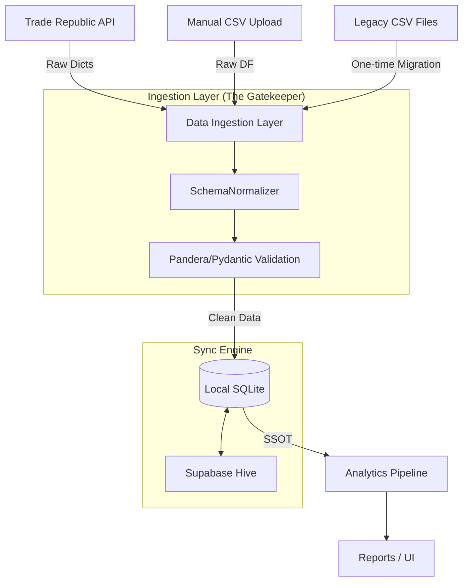

# Strategic Implementation Plan: SQLite as Single Source of Truth (SSOT)

## 1. Context & Motivation
Currently, Portfolio Prism uses a **"CSV-Relational Hybrid"** architecture. While simple, this has led to significant fragility:
- **Schema Drift:** Different data paths (Trade Republic Sync, CSV Fallback, Manual Upload) use different column names (`ISIN` vs `isin`, `Asset_Class` vs `asset_type`).
- **Normalization Lag:** Data is often normalized *too late* (in the middle of the pipeline), leading to merge failures and logic errors.
- **Test Fragility:** E2E tests rely on external CSV fixtures that are hard to maintain and isolate.
- **Concurrency Issues:** CSVs lack ACID transactions, making them risky for multi-process access (Tauri + Python Sidecar).

**Goal:** Move to a **"Local-First, SQLite-Centric"** architecture where all data enters through a validated Ingestion Layer and the Pipeline reads from a single, consistent source.

---

## 2. Target Architecture

---

## 3. Implementation Phases

### Phase 1: The Data Contract (`schema.py`)
Define canonical column names and validation rules.
- **Task 1.1:** Create `portfolio_src/core/schema.py`.
- **Task 1.2:** Define `Column` Enum for all standard fields (isin, name, quantity, etc.).
- **Task 1.3:** Implement `PositionsSchema` using **Pandera** for DataFrame-level validation.
- **Task 1.4:** Implement `AssetUniverseSchema` for metadata validation.

### Phase 2: The Ingestion Layer (`ingestion.py`)
Create a single service responsible for writing to the database.
- **Task 2.1:** Create `portfolio_src/data/ingestion.py`.
- **Task 2.2:** Implement `DataIngestion.ingest_positions(df: pd.DataFrame)`.
    - Must call `SchemaNormalizer` first.
    - Must validate against `PositionsSchema`.
    - Must perform an `UPSERT` into SQLite.
- **Task 2.3:** Implement `DataIngestion.ingest_metadata(df: pd.DataFrame)`.
    - Handles asset universe updates from Hive or manual sources.

### Phase 3: Database Refactoring (`database.py`)
Upgrade the local storage engine.
- **Task 3.1:** Update `portfolio_src/data/database.py` to use WAL (Write-Ahead Logging) mode for concurrency.
- **Task 3.2:** Define strict SQL schemas for `assets` and `holdings` tables with proper Primary/Foreign keys.
- **Task 3.3:** Implement `upsert` methods to prevent duplicates.

### Phase 4: Hive Sync Integration
Ensure the local DB and remote Hive stay in sync without CSV intermediaries.
- **Task 4.1:** Refactor `HiveClient.sync_universe()` to write directly to the `assets` table via the Ingestion Layer.
- **Task 4.2:** Implement a "Dirty Flag" or `last_synced` timestamp in the `assets` table to track local vs. community data.
- **Task 4.3:** Ensure PII scrubbing happens *before* any local data is pushed to the Hive.

### Phase 5: Pipeline & Cleanup
Point the "brain" to the new source.
- **Task 5.1:** Update `Pipeline._load_portfolio()` to read exclusively from SQLite.
- **Task 5.2:** **DELETE** the CSV fallback logic in `state_manager.py`.
- **Task 5.3:** Create a one-time migration script `scripts/migrate_v0_to_v1.py` that reads existing CSVs and pushes them through the Ingestion Layer.
- **Task 5.4:** Remove `HOLDINGS_PATH` and `UNIVERSE_PATH` constants from config.

---

## 4. Testing Strategy
- **Unit Tests:** Verify `SchemaNormalizer` handles all known variations (TR, iShares, Vanguard).
- **Contract Tests:** Verify `DataIngestion` rejects invalid data (e.g., negative quantities, invalid ISINs).
- **Integration Tests:** Use a temporary SQLite database fixture for all pipeline tests. **No more CSV fixtures.**
- **Migration Tests:** Verify that a v0 CSV file is correctly ingested into a v1 SQLite DB.

---

## 5. Success Criteria
1. `load_portfolio_state()` contains zero references to `.csv` files.
2. The `assets` table in SQLite is the authoritative source for ISIN → Ticker resolution.
3. All 44+ tests pass with a clean, isolated SQLite environment.
4. `npm run dev:browser` works with real data synced from the Hive into the local DB.

---

## 6. Context for the Next AI
> "We are moving away from a fragile system where data was merged across CSV files with inconsistent headers. We have already fixed the immediate E2E failures by adding normalization, but we want a permanent architectural fix. Your task is to implement the **SQLite SSOT** pattern. Start by defining the `Schema` and `DataIngestion` layer, then refactor the `Pipeline` to stop looking at CSV files entirely. The user's privacy is paramount: keep the local-first philosophy but use a real database for integrity."
