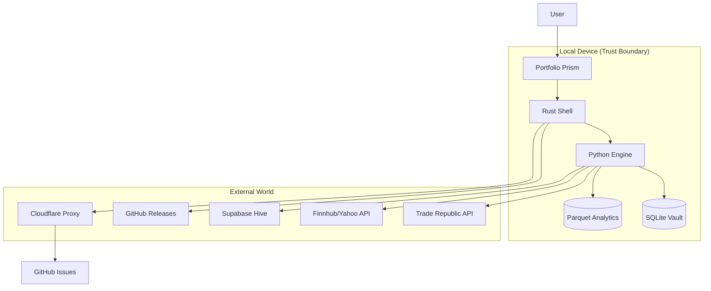
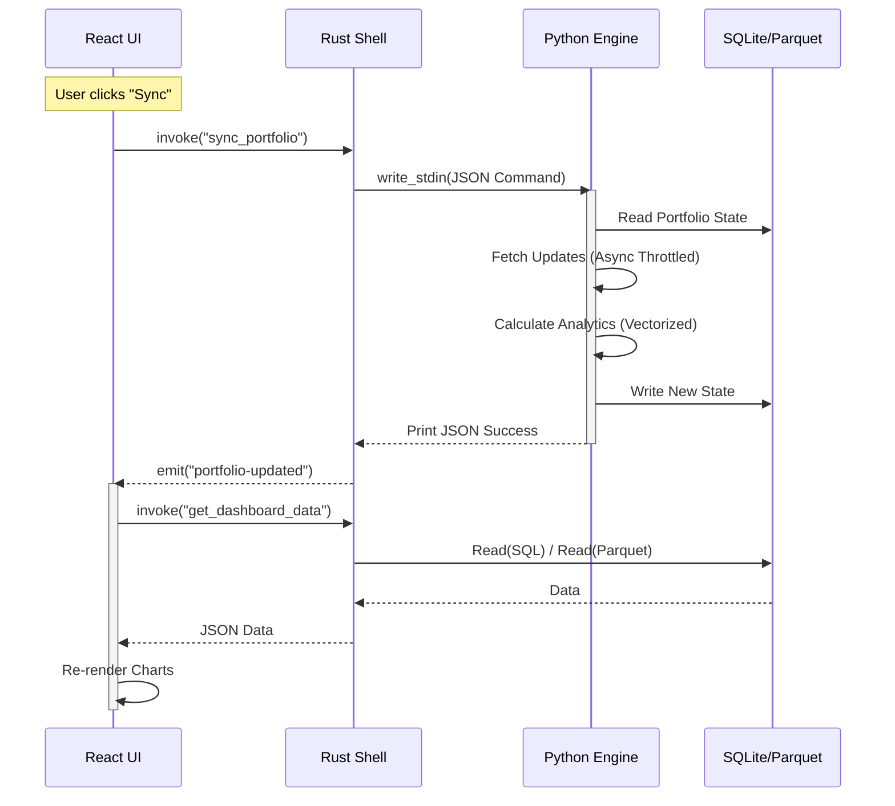
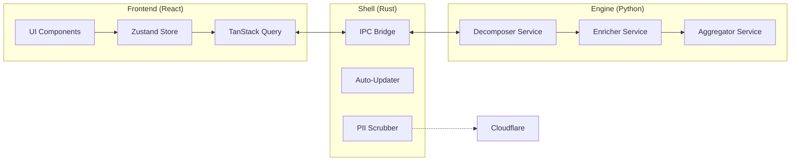
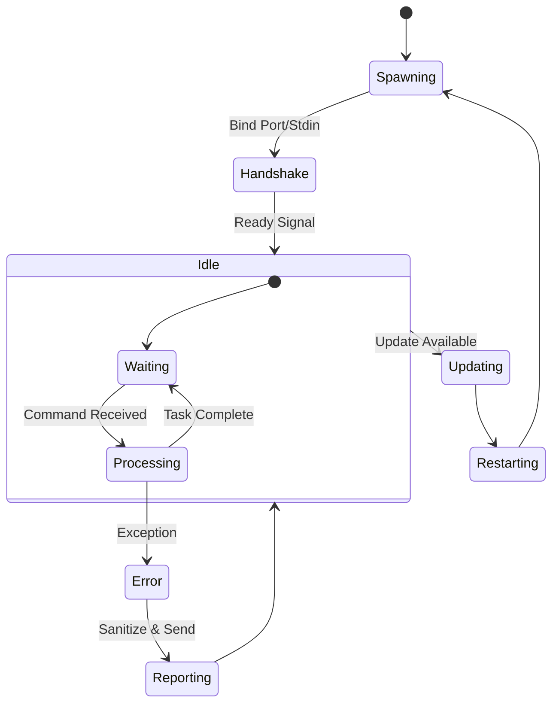

# Design Spec (The "How It Works")

> **Usage:** Create visual diagrams for complex flows using Mermaid.js syntax.
> **See Strategy:** `keystone/strategy/architecture-overview.md` for the Master Architecture.

---

## 1. System Context Diagram

High-level view of system boundaries and external actors.

---

## 2. Sequence Diagrams

### Data Sync Flow (Rapid Feedback Loop)

---

## 3. Component Diagram

Modular architecture showing dependencies.

---

## 4. State Diagrams

### Engine Lifecycle

