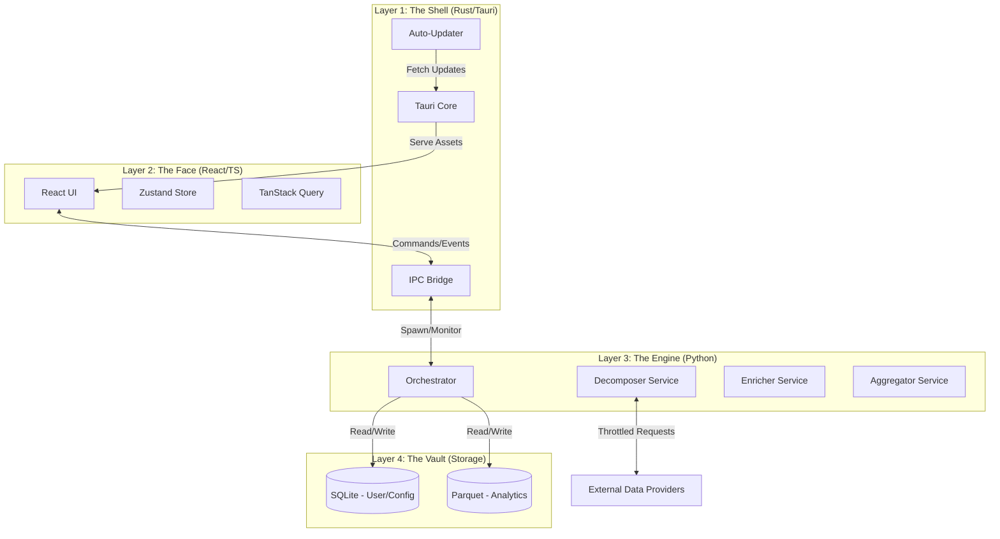

# Master Architecture Strategy

> **Purpose:** The single source of truth for Portfolio Prism's system architecture, binding all component strategies into a unified vision.
> **Scope:** High-level interactions, data flow, boundaries, and governing architectural rules.
> **Authority:** Overrides individual component strategies in case of conflict.

---

## 1. Architectural Vision

Portfolio Prism is a **Local-First, Reactive Analytics Platform**.

*   **Local-First:** User data resides in an ACID-compliant SQLite vault on the device. "SaaS" capabilities refer to rapid *code distribution* (updates), not cloud *data processing*.
*   **Reactive:** The UI reacts to state changes in the Vault. The Engine is an event-driven worker that wakes up, processes data, updates the Vault, and sleeps.
*   **Three-Tier Hybrid:** It leverages the unique strengths of three ecosystems:
    *   **Rust (Shell):** Security, Process Management, OS Integration.
    *   **React (Face):** Responsive UX, Modern Interactivity.
    *   **Python (Engine):** Financial Analytics, Data ETL.

---

## 2. The "Prism Architecture" Diagram

---

## 3. Core Architectural Decisions (The Manifesto)

### **Rule 1: React-First MVP**
*   **Decision:** MVP built directly in React + TypeScript (Streamlit phase bypassed).
*   **Implication:** Python runs as headless sidecar (stdin/stdout JSON IPC). The build system serves the Vite/React bundle.

### **Rule 2: State-at-Rest vs. State-in-Motion**
*   **At Rest (Storage):** Data sleeps in **SQLite** (Transactional/User Data) and **Parquet** (Analytics/Cache). This ensures ACID compliance and schema integrity.
*   **In Motion (Processing):** Data wakes up into **Pandas DataFrames** for the pipeline. The Engine is responsible for the efficient "Inflate/Deflate" (SQL ↔ DataFrame) conversion.
*   **Interface:** The Pipeline never exposes DataFrames to the Shell. It exposes structured JSON results or writes directly to the Vault.

### **Rule 3: Throttled Agility**
*   **Decision:** The Analytics Engine uses Async I/O for parallelism but is **strictly throttled**.
*   **Mechanism:** A client-side `Semaphore` ensures we respect the API rate limits defined in `external-integrations.md`, prioritizing reliability over raw speed.

### **Rule 4: SaaS as Distribution**
*   **Definition:** "SaaS Readiness" means the ability to push secure code updates to users in minutes via the Tauri Updater.
*   **Boundary:** User financial data **never** leaves the device for processing. Cloud features (Sync) are optional, encrypted, and storage-only.

---

## 4. The "Rapid Feedback" Data Cycle

To achieve the vision of a responsive application, data flows in a strict unidirectional loop:

1.  **User Action:** User clicks "Sync Portfolio" in React.
2.  **Command:** React sends an IPC command (`sync_portfolio`) to Rust.
3.  **Delegation:** Rust invokes the Python Sidecar with the specific command.
4.  **Execution (The Engine):**
    *   **Load:** Python reads current state from SQLite.
    *   **Fetch:** Decomposer fetches new data (Throttled Async).
    *   **Compute:** Aggregator calculates metrics (Vectorized).
    *   **Save:** Results are written back to SQLite/Parquet.
5.  **Notification:** Python exits/returns success. Rust emits an event (`portfolio-updated`) to the frontend.
6.  **Reaction:** React (TanStack Query) detects the event, invalidates the cache, and re-reads the fresh data directly from the Vault (or via Rust command).

---

## 5. Dependency Graph

To prevent a "Big Ball of Mud", dependencies are strictly hierarchical:

1.  **Level 0 (Storage):** SQLite Schema, Parquet structure. (Depends on nothing).
2.  **Level 1 (Engine):** Python Code. (Depends on Storage Schema).
3.  **Level 2 (Shell):** Rust Code. (Depends on Python Interface & Storage access).
4.  **Level 3 (UI):** React Code. (Depends on Rust Commands & Events).

*Violation Check:* React code should never know about "DataFrames". Python code should never know about "React State".

---

## 6. Cross-Cutting Concerns

### **Telemetry Strategy (Unified)**
*   **Principle:** "Privacy-Filtered Logging."
*   **Implementation:** Logs from Python, Rust, and React are aggregated in the Shell. Before transmission (if opted-in), a "Scrubber" removes all PII and financial values, leaving only error codes and performance metrics.

### **Testing Strategy (The Pyramid)**
1.  **Unit Tests (Base):**
    *   Python: `pytest` for pipeline logic (mocking DB/API).
    *   Rust: `cargo test` for shell logic.
    *   React: `vitest` for components.
2.  **Integration Tests (Middle):**
    *   Rust tests creating a fresh SQLite DB, spawning Python, and verifying DB state changes.
3.  **E2E Tests (Top):**
    *   Minimal playwright/tauri-driver tests for critical user flows (App Launch, Sync).

### **Security Strategy**
*   **Process Isolation:** The Python engine runs as a subprocess.
*   **Network Allow-list:** (Future Goal) The Python process is sandboxed to only access whitelisted API domains (Trade Republic, etc.) to prevent data exfiltration.

---

## 7. Next Steps

1.  **Telemetry & Testing:** Draft the specific strategies for these cross-cutting concerns.
2.  **Implementation Plan:** Convert this architecture into a task-level roadmap.
3.  **Execution:** Begin Phase 1 (React Foundation & Build System Revolution).

---

## 8. Runtime Patterns

### 8.1 Dead Man's Switch
Tauri keeps stdin pipe open to Python. Python monitors stdin; EOF = parent died → self-terminate.

### 8.2 Data Directory Injection
Python reads `PRISM_DATA_DIR` env var. Tauri sets this to OS-appropriate path at spawn.

### 8.3 Throttled Agility
Python Engine uses `asyncio` for parallelism but enforces `Semaphore(5)` for rate limits.

### 8.4 Hive RPC Delegation
ALL data contributions and transactional logic MUST use PL/pgSQL RPC functions (`contribute_asset`, etc.).
- Ensures atomicity
- Safely bypasses RLS via `SECURITY DEFINER`
- Centralizes validation logic
